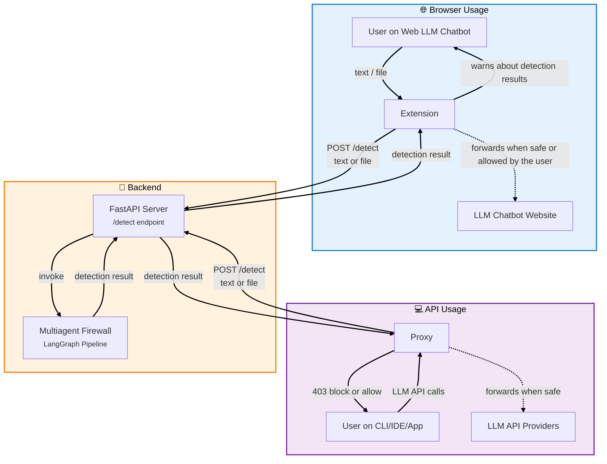

# 🛡️ Sensitive Data Detector

Modular architecture to detect and prevent private data leakage in user-LLM interactions.

## 📦 Packages

### 🧱 Multiagent Firewall
Implements a LangGraph-based multiagent firewall for advanced data leakage detection and policy management.

### 🔌 Backend
Provides a FastAPI server as a bridge to connect proxy and extension packages with the multiagent firewall

### 🌐 Extension
Chromium based extension that analyzes user and LLM interactions to detect sensitive data and provide feedback to the user within the browser.

### 🧩 Proxy
Protect user and LLM interactions via command-line clients, IDEs or applications by routing their LLM API calls through the multiagent firewall.

## 🔄 Architecture



## 🛠️ Set up 

### 1. uv
Install [uv](https://docs.astral.sh/uv/#installation) (modern Python package manager):

### 2. Configure package options
- `backend`: Copy `backend/.env.example` to `backend/.env` and configure to your liking.
- `multiagent-firewall`: Customize detection pipeline via `multiagent-firewall/config/pipeline.json` and detection options via `multiagent-firewall/config/detection.json`. More details in `multiagent-firewall/README.md`
- `proxy`: Copy `backend/.env.example` to `backend/.env` and configure to your liking.
- `extension`: Modify `extension/src/config.js`

### 3. Run backend server
The backend package simplifies the connection between the `proxy` and `extension` modules.

```bash
cd backend && uv sync && uv run python -m app.main
```

> [!NOTE]
> Alternatively, you can build the `backend` image using the provided Dockerfile:
> ```bash
> docker build -t sensitive-data-detector .
> docker run -p 8000:8000 --env-file .env sensitive-data-detector
> ```

### 4a. Load extension
1. Go to chrome://extensions/
2. Toggle on "Developer mode"
3. Click "Load unpacked" → choose path to `sensitive-data-detector/extension/`

The extension will intercept web chatbots interactions (ChatGPT, Gemini...) and provide feedback to the user regarding any potential sensitive information leakage based on the configured options.

### 4b. Run proxy

Detailed information on how to run the proxy package under `proxy/README.md`

The proxy will act as a middleman between the user and any listed endpoint under `proxy/.env`

## 📜 License

MIT license.
