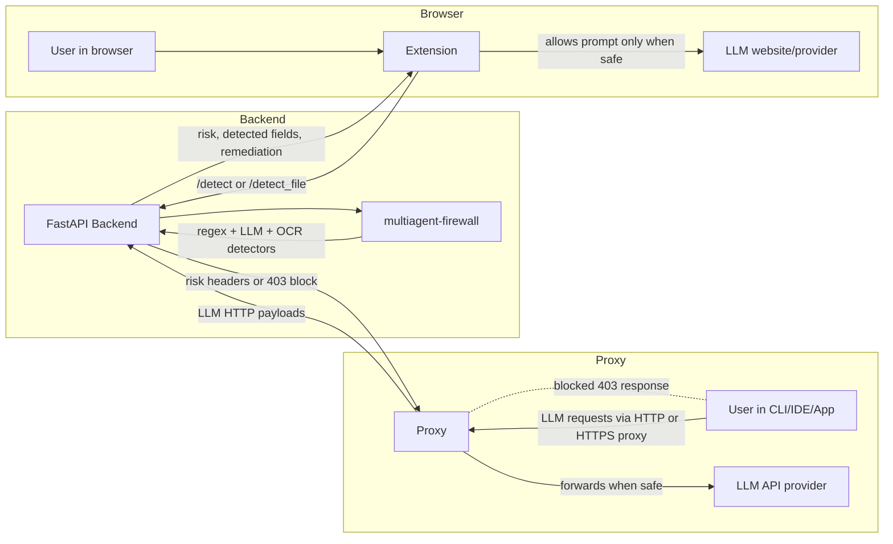

# 🛡️ LLM Guard 

Detect and prevent private data leakage in user-LLM interactions.

## 📦 Packages

### 🧱 Multiagent Firewall
Implements a LangGraph-based multiagent firewall for advanced policy enforcement and detection.

### 🔌 Backend
Provides a FastAPI server for analyzing and detecting sensitive data in LLM interactions

### Extension
Chromium based extension that analyzes user and LLM interactions to detect sensitive data and provide feedback to the user within the browser.

### 🧩 Proxy
Protect user and LLM interactions via command-line clients, IDEs or applications by routing their LLM API calls through our multiagent firewall.

## 🔄 Package Flow



---

## ⚡ Exclusive features of this fork
- Proxy server that acts as a MiTM to analyse and block all sensitive LLM API interactions
- Cleaner project structure
- Chromium extension blocks prompt sending until analysed and user explicitly allows it.
- Easier backend server setup via a shared `uv` workspace and Dockerfile
- Unified LiteLLM integration for 100+ providers with simple `.env` overrides
- Local model support through Ollama
- Test suite on every package and CI workflow

---

## 🛠️ Set up and usage

### 1. uv
Install [uv](https://docs.astral.sh/uv/#installation) (modern Python package manager):

```bash
curl -LsSf https://astral.sh/uv/install.sh | sh
```

### 2. Set up environment variables
- `backend`: Copy `backend/.env.example` to `backend/.env` and configure to your liking.
- `proxy`: Copy `backend/.env.example` to `backend/.env` and configure to your liking.
- `extension`: Modify `extension/src/config.js`

### 3. Install dependencies and run
From the directory of the desired package (either `backend` or `proxy`):

```bash
uv sync

uv run python -m app.main
```

> [!NOTE]
> Alternatively, you can build the `backend` image using the provided Dockerfile:
> ```bash
> docker build -t sensitive-data-detector .
> docker run -p 8000:8000 --env-file .env sensitive-data-detector
> ```

### 4. Load extension
1. Go to chrome://extensions/
2. Toggle on "Developer mode"
3. Click "Load unpacked" → choose path to `sensitive-data-detector/extension/`

> [!IMPORTANT]
> Ensure the host and ports of each package don't overlap with any other opened ports on your machine and that each package properly points to the backend port

---

## 🧪 Tests
Each package has its own test suite that can be run with the following commands
```bash
uv sync --project <package> --group test
uv run --project <package> --group test bash -lc "PYTHONPATH=<package> pytest <package>/tests"
```

Or, from each package directory:
```bash
uv sync
uv run pytest
```

## 📜 License

This project is under the MIT license.
Check the file LICENSE for more details.
