# 🛡️ Sensitive Data Detector

Modular architecture to detect and prevent private data leakage in user-LLM interactions.

## 📦 Packages

### 🧱 Multiagent Firewall
Implements a LangGraph-based multiagent firewall for advanced data leakage detection and policy management.

### 🔌 Backend
Provides a FastAPI server as a bridge to connect proxy and extension packages with the multiagent firewall

### 🌐 Extension
Chromium based extension that analyzes user and LLM interactions to detect sensitive data and provide feedback to the user within the browser.

### 🧩 Proxy
Protect user and LLM interactions via command-line clients, IDEs or applications by routing their LLM API calls through the multiagent firewall.

## 🔄 Architecture

```mermaid
flowchart TB
    subgraph Browser["🌐 Browser Usage"]
        USER1[User on Web LLM Chatbot]
        EXT[Extension]
        CHATGPT[LLM Chatbot Website]
        
        USER1 -->|text / file| EXT
        EXT -->|warns about detection results| USER1
        EXT -.->|forwards when safe or allowed by the user| CHATGPT
    end
    subgraph SystemWide["💻 System-Wide Usage"]
        USER2[User on CLI/IDE/App]
        PROXY[Proxy]
        LLMAPI[LLM API Providers<br/><small>OpenAI, Claude, etc.</small>]
        
        USER2 -->|LLM API calls| PROXY
        PROXY -->|403 block or allow| USER2
        PROXY -.->|forwards when safe| LLMAPI
    end
    subgraph Backend["🔌 Backend"]
        API[FastAPI Server<br/><small>/detect endpoint</small>]
        FIREWALL[Multiagent Firewall<br/><small>LangGraph Pipeline</small>]
        API -->|invoke | FIREWALL
        FIREWALL -->|detection result| API
    end
    EXT -->|POST /detect<br/>text or file| API
    PROXY -->|POST /detect<br/>text or file| API
    
    API -->|detection result| EXT
    API -->|detection result| PROXY
    style Browser fill:#e3f2fd,stroke:#1976d2,stroke-width:2px,color:#000
    style SystemWide fill:#f3e5f5,stroke:#7b1fa2,stroke-width:2px,color:#000
    style Backend fill:#fff3e0,stroke:#f57c00,stroke-width:2px,color:#000

    linkStyle default stroke:#000,stroke-width:2px
```



---

## 🛠️ Set up and usage

### 1. uv
Install [uv](https://docs.astral.sh/uv/#installation) (modern Python package manager):

```bash
curl -LsSf https://astral.sh/uv/install.sh | sh
```

### 2. Configure package options
- `backend`: Copy `backend/.env.example` to `backend/.env` and configure to your liking.
- `proxy`: Copy `backend/.env.example` to `backend/.env` and configure to your liking.
- `extension`: Modify `extension/src/config.js`

### 3. Run backend server
The backend package simplifies the connection between the `proxy` and `extension` modules.

```bash
cd backend

uv sync

uv run python -m app.main
```

> [!NOTE]
> Alternatively, you can build the `backend` image using the provided Dockerfile:
> ```bash
> docker build -t sensitive-data-detector .
> docker run -p 8000:8000 --env-file .env sensitive-data-detector
> ```

### 4a. Load extension
1. Go to chrome://extensions/
2. Toggle on "Developer mode"
3. Click "Load unpacked" → choose path to `sensitive-data-detector/extension/`

The extension will intercept web chatbots interactions (ChatGPT, Claude, Gemini...) and provide feedback to the user regarding any potential sensitive information leakage

### 4b. Run proxy

Detailed information on how to run the proxy package under `proxy/README.md`

The proxy will act as a middleman between the user and any listed endpoint under `proxy/.env`

> [!IMPORTANT]
> Ensure the host and ports of each package don't overlap with any other opened ports on your machine and that each package properly points to the backend port

---

## 🧪 Tests
Each package has its own test suite that can be run with the following commands
```bash
uv sync --project <package> --group test
uv run --project <package> --group test bash -lc "PYTHONPATH=<package> pytest <package>/tests"
```

Or, from each package directory:
```bash
uv sync
uv run pytest
```

## 📜 License

This project is under the MIT license.
Check the file LICENSE for more details.
