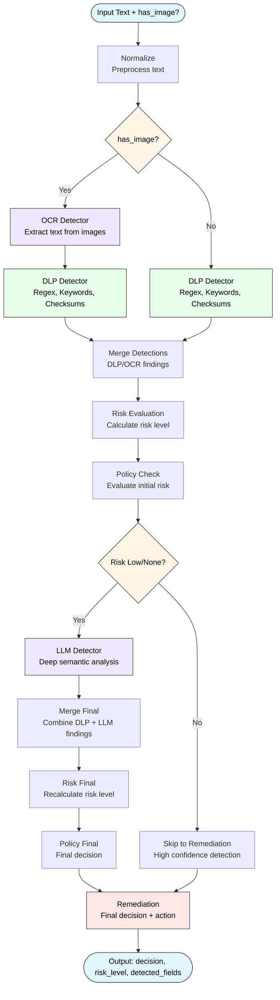

# Multiagent Firewall for LLM Interactions

A sophisticated multi-agent system that detects sensitive data in LLM prompts using a combination of DLP (Data Loss Prevention), LLM-based detection, and risk evaluation strategies.

## Architecture

The firewall uses a multi-agent architecture built on LangGraph with conditional routing for optimal performance:



## Usage

### Via the backend package
Our `backend/` package exposes an HTTP api that can be used to automatically call the multiagent pipeline

### From another Python project

```python
from multiagent_firewall.orchestrator import GuardOrchestrator

orchestrator = GuardOrchestrator()

result = orchestrator.run(text="My SSN is 123-45-6789")

print(f"Decision: {result['decision']}")
print(f"Risk Level: {result['risk_level']}")
print(f"Detected Fields: {result['detected_fields']}")

result = orchestrator.run(
    text="Sensitive data",
    mode="enriched-zero-shot"  # zero-shot, few-shot, or enriched-zero-shot
)
```

### Response Structure

The orchestrator returns a `GuardState` dictionary with:

```python
{
    "raw_text": str,              # Original input text
    "normalized_text": str,       # Preprocessed text
    "detected_fields": [          # List of detected sensitive fields
        {
            "type": str,          # Field type (SSN, EMAIL, etc.)
            "value": str,         # Detected value
            "confidence": float,  # Detection confidence (0-1)
            "source": str         # Detection source (dlp/llm)
        }
    ],
    "risk_level": str,            # None/Low/Medium/High/Critical
    "decision": str,              # allow/allow_with_warning/block
    "remediation": str            # Suggested action
}
```

## Testing

### Unit Tests

```bash
uv sync --group test
```

```bash
uv run pytest
```

### Integration Tests

Integration tests run the full pipeline end-to-end with real LLM providers.

#### Setup

1. Create `.env` file in `integration_tests/`:

```bash
cd integration_tests
cp .env.example .env
```

2. Configure your LLM provider settings:

```bash
LLM_PROVIDER=openai
LLM_MODEL=gpt-4
LLM_API_KEY=sk-your-actual-api-key-here
```

**Note:** For Ollama (local models), LLM_API_KEY is not needed but must have a random value

#### Running Integration Tests

```bash
cd integration_tests
./run_tests.sh
```

This will:
- Run all test cases against the full pipeline
- Calculate accuracy, precision, recall, and F1 metrics
- Cache results to avoid redundant LLM calls
