# Multiagent Firewall for LLM Interactions

Multi-agent system that detects sensitive data in LLM prompts

## Architecture

The firewall uses a multi-agent architecture built on LangGraph with conditional routing for optimal performance:

```mermaid
flowchart TD
    Start([START]) --> HasFile{Has file?}

    HasFile -->|Yes| Document[read_document<br/>Document parsing + Tesseract OCR]
    HasFile -->|No| Normalize[normalize]

    Document --> NeedsLLMOCR{Image and<br/>no OCR results?}
    NeedsLLMOCR -->|Yes| LLMOCR[llm_ocr<br/>LLM Vision Model OCR]
    NeedsLLMOCR -->|No| Normalize
    LLMOCR --> Normalize

    Normalize --> DLP[dlp_detector<br/>Regex, Keyword, Checksum]
    Normalize --> NER[ner_detector<br/>GLiNER NER]
    Normalize --> CodeSim[code_similarity_detector<br/>Proprietary Code Detection]
    DLP --> MergeDLP[merge_dlp_ner<br/>Merge detections]
    NER --> MergeDLP
    CodeSim --> MergeDLP
    MergeDLP --> HasPreLLM{Any DLP/NER findings?}

    HasPreLLM -->|Yes| RiskDLP[risk_dlp_ner<br/>Risk evaluation]
    HasPreLLM -->|No| LLM[llm_detector<br/>LLM-based detection]

    RiskDLP --> PolicyDLP[policy_dlp_ner<br/>Policy check]
    PolicyDLP --> DecisionBlock{decision = block?}
    DecisionBlock -->|Yes + FORCE_LLM_DETECTOR=false| Remediation[remediation<br/>Generate remediation message]
    DecisionBlock -->|Yes + FORCE_LLM_DETECTOR=true| AnonymizeLLM[anonymize_dlp_ner<br/>Anonymize DLP/NER findings]
    DecisionBlock -->|No| AnonymizeLLM

    AnonymizeLLM --> LLM

    LLM --> MergeFinal[merge_final<br/>Merge detections]
    MergeFinal --> FinalRoute{Has detected fields?}
    FinalRoute -->|No| End([END])
    FinalRoute -->|Yes, including new fields| RiskFinal[risk_final<br/>Risk evaluation]
    FinalRoute -->|Yes, but no new ones| Remediation[remediation<br/>Generate remediation message]
    RiskFinal --> PolicyFinal[policy_final<br/>Policy check]
    PolicyFinal --> Remediation

    Remediation --> FinalAnonymize[final_anonymize<br/>Anonymize all detected fields]
    FinalAnonymize --> End

    style Start fill:#e1f5ff,stroke:#333,color:#000
    style End fill:#e1f5ff,stroke:#333,color:#000
    style HasFile fill:#fff4e6,stroke:#333,color:#000
    style NeedsLLMOCR fill:#fff4e6,stroke:#333,color:#000
    style HasPreLLM fill:#fff4e6,stroke:#333,color:#000
    style FinalRoute fill:#fff4e6,stroke:#333,color:#000
    style DecisionBlock fill:#fff4e6,stroke:#333,color:#000
    style Document fill:#e6f7ff,stroke:#333,color:#000
    style LLMOCR fill:#f0e6ff,stroke:#333,color:#000
    style AnonymizeLLM fill:#f0e6ff,stroke:#333,color:#000
    style FinalAnonymize fill:#f0e6ff,stroke:#333,color:#000
    style LLM fill:#f0e6ff,stroke:#333,color:#000
    style DLP fill:#e6ffe6,stroke:#333,color:#000
    style NER fill:#e6ffe6,stroke:#333,color:#000
    style CodeSim fill:#e6ffe6,stroke:#333,color:#000
    style Remediation fill:#ffe6e6,stroke:#333,color:#000
    style MergeDLP fill:#fff9e6,stroke:#333,color:#000
    style MergeFinal fill:#fff9e6,stroke:#333,color:#000
    style RiskDLP fill:#e6f3ff,stroke:#333,color:#000
    style RiskFinal fill:#e6f3ff,stroke:#333,color:#000
    style PolicyDLP fill:#ffe6f0,stroke:#333,color:#000
    style PolicyFinal fill:#ffe6f0,stroke:#333,color:#000
```



## Usage

### Via the backend package
Our `backend/` package exposes an HTTP API that can be used to serve an endpoint and call the multiagent pipeline. See `backend/README.md` for more information

### From another Python project

#### Text Detection
```python
from multiagent_firewall import GuardConfig, GuardOrchestrator

config = GuardConfig.from_env()
orchestrator = GuardOrchestrator(config)

# Detect sensitive data in text
result = orchestrator.run(
  text="My SOCIALSECURITYNUMBER is 123-45-6789",
  min_block_risk="low"
)

print(f"Decision: {result['decision']}")
print(f"Risk Level: {result['risk_level']}")
print(f"Detected Fields: {result['detected_fields']}")
```

#### PDF Detection
Requires the optional `file-analysis` extra for PDF parsing.
```python
from multiagent_firewall import GuardConfig, GuardOrchestrator

config = GuardConfig.from_env()
orchestrator = GuardOrchestrator(config)

result = orchestrator.run(file_path="/path/to/document.pdf")

print(f"Decision: {result['decision']}")
print(f"Risk Level: {result['risk_level']}")
print(f"Detected Fields: {result['detected_fields']}")
```

#### Image Detection (OCR must be configured)
Requires the optional `file-analysis` extra and a system Tesseract install for OCR.
```python
from multiagent_firewall import GuardConfig, GuardOrchestrator

config = GuardConfig.from_env()
orchestrator = GuardOrchestrator(config)

result = orchestrator.run(file_path="/path/to/screenshot.png")

print(f"OCR extracted text: {result['raw_text']}")
print(f"Risk Level: {result['risk_level']}")
print(f"Detected Fields: {result['detected_fields']}")
```

### Response Structure

The orchestrator returns a `GuardState` dictionary. Keys are added as the pipeline runs,
so some fields are optional depending on the input and routing:

```python
{
    "raw_text": str,              # Input text or extracted file text
    "file_path": str | None,      # Provided file path (if any)
    "min_block_risk": str,        # Normalized threshold (none/low/medium/high)
    "llm_provider": str,          # Provider from config
    "normalized_text": str,       # Preprocessed text used by detectors
    "anonymized_text": str,       # Redacted text (only when findings exist)
    "detected_fields": [          # Final merged findings
        {
            "field": str,         # Canonical field name (EMAIL, PASSWORD, OTHER, ...)
            "value": str,         # Detected value
            "risk": str,          # low/medium/high
            "sources": [str]      # dlp_regex/dlp_keyword/dlp_checksum/ner_gliner/llm_explicit/llm_inferred
        }
    ],
    "dlp_fields": [               # Raw DLP findings (same shape as LLM minus risk)
        {"field": str, "value": str, "sources": [str]}
    ],
    "ner_fields": [               # Raw NER findings (same shape as LLM minus risk)
        {"field": str, "value": str, "sources": [str], "score": float | None}
    ],
    "llm_fields": [               # Raw LLM findings (same shape as LLM minus risk)
        {"field": str, "value": str, "sources": [str]}
    ],
    "risk_level": str,            # none/low/medium/high
    "decision": str,              # allow/warn/block
    "remediation": str,           # Empty string when allow
    "metadata": {                 # File + anonymization metadata
        "file_type": "image|pdf|text",
        "ocr_attempted": bool,
        "tesseract_text_found": bool,
        "llm_ocr_used": bool,
        "ocr_method": "tesseract|llm",
        "llm_anonymized_values": {
            "enabled": True,
            "provider": "openai",
            "mapping": {"secret123": "<<REDACTED:PASSWORD>>"}
        }
    },
    "warnings": [str],            # Non-fatal issues (missing text, OCR fallback, ...)
    "errors": [str]               # Errors during extraction/detection
}
```

## Configuration

Create a `GuardConfig` and pass it to `GuardOrchestrator`. For convenience, you can build it from environment variables once at startup:

```python
from multiagent_firewall import GuardConfig, GuardOrchestrator

config = GuardConfig.from_env()
orchestrator = GuardOrchestrator(config)

result = orchestrator.run(file_path="/path/to/screenshot.png", min_block_risk="low")
```

### Environment Variables

Configuration is loaded from environment variables or a `.env` file in the package root (`multiagent-firewall/.env`).
Copy `.env.example` to get started:

```bash
cp .env.example .env
```

#### LLM Configuration (Required)
```bash
LLM_PROVIDER=openai          # LLM provider (openai, ollama, etc.)
LLM_MODEL=gpt-4o-mini        # Model name
LLM_API_KEY=sk-xxx           # API key for the provider
LLM_BASE_URL=https://...     # Optional: custom API base URL
```

#### LLM Extra Params (Optional)
`LLM_EXTRA_PARAMS` is a JSON object passed to LiteLLM. For deterministic DLP-style detection, the following greedy configuration is a good default.

```bash
LLM_EXTRA_PARAMS='{
  "temperature": 0,                 # Deterministic output for classification
  "top_p": 1.0,                      # Full nucleus to match greedy decode
  "frequency_penalty": 0,           # Neutral for OpenAI-style APIs
  "presence_penalty": 0,            # Neutral for OpenAI-style APIs
  "repeat_penalty": 1.0,            # Neutral for Ollama/Llama
  "top_k": 1,                       # Greedy decode for Ollama/Llama
  "drop_params": true,              # Strip unsupported params per provider
  "response_format": {"type":"json_object"} # Ask for JSON mode when supported
}'
```

#### OCR Configuration (Optional)
```bash
OCR_LANG=eng                 # Tesseract language code (default: eng, more languages: install specific language for tesseract and add it (e.g: eng+esp))
OCR_CONFIDENCE_THRESHOLD=60  # Minimum confidence 0-100 (default: 0)
TESSERACT_CMD=/usr/bin/tesseract  # Custom Tesseract path
LLM_OCR_PROVIDER=groq
LLM_OCR_MODEL=meta-llama/llama-4-scout-17b-16e-instruct
LLM_OCR_API_KEY=your-provider-api-key
LLM_OCR_BASE_URL=https://api.groq.com/openai/v1
```

Note: `LLM_OCR_*` falls back to `LLM_*` values for provider/model/keys, but `LLM_OCR_EXTRA_PARAMS` does not fall back and must be set explicitly if needed.

#### File Analysis Dependencies (Optional)
PDF parsing and Tesseract OCR are shipped as a separate extra to keep the base install light.

```bash
uv sync --extra file-analysis
```
If you only need text detection, you can skip this extra.

#### NER Configuration (Optional)
NER comes as an extra optional dependency due to its large download size. The following command and configuration enables it:

```bash
uv sync --extra ner
```

```bash
NER_ENABLED=true             # Enable GLiNER-based NER detector (default: false)
NER_MODEL=urchade/gliner_multi-v2.1      # GLiNER model name or path (See urchade available models: https://huggingface.co/urchade/gliner_multi-v2.1#available-models)
NER_MIN_SCORE=0.7            # Minimum score threshold (default: 0.5)
```
Label mapping is defined in `multiagent-firewall/multiagent_firewall/config/detection.json` as `ner_labels`.

#### Code Analysis Configuration (Optional)
Code analysis enables detection of proprietary code snippets by comparing user input against private Git repositories. Install the optional dependency group:

```bash
uv sync --extra code-analysis
```

```bash
CODE_ANALYSIS_ENABLED=true                    # Enable code similarity detector (default: false)
CODE_ANALYSIS_REPO_URL=https://github.com/org/repo1.git,https://github.com/org/repo2.git  # Comma-separated Git URLs
CODE_ANALYSIS_AUTH_TOKEN=ghp_xxx              # GitHub PAT for private repos (optional for public)
CODE_ANALYSIS_SIMILARITY_THRESHOLD=0.85       # Match threshold 0.0-1.0 (default: 0.85)
CODE_ANALYSIS_REFRESH_INTERVAL=3600           # Seconds between repo pulls (default: 3600)
CODE_ANALYSIS_CACHE_DIR=/tmp/code-similarity-cache  # Local clone directory
CODE_ANALYSIS_MIN_SNIPPET_LENGTH=50           # Minimum chars to analyze (default: 50)
```

Compares against supported file extensions specified in `code_similarity.py`

Detected matches are flagged as `PROPRIETARY_CODE` with high risk.

#### Blocking Policy
```bash
MIN_BLOCK_RISK=medium        # Options: low, medium, high
```
`MIN_BLOCK_RISK` is applied per invocation (pass `min_block_risk` to `GuardOrchestrator.run`); it defaults to `medium` if omitted.

### Detection Configuration

The firewall supports editing detection rules in `multiagent-firewall/multiagent_firewall/config/detection.json`:
- `prompts`: Filenames for LLM detector and OCR prompts (stored in `prompts/`)
- `regex_patterns`: regex-based DLP patterns, with optional keyword windows
- `keywords`: keyword-based DLP phrases
- `ner_labels`: NER label → field mapping
- `risk`:
  - `scores`: scoring weights of each field level
  - `thresholds`: threshold to calculate global risk value based on the sum of all detected fields
- `risk_fields`: Sets of fields classified as `high`, `medium`, or `low` risk

#### DLP Regex Configuration
Regex-based DLP patterns live in `detection.json` under `regex_patterns`.
Each entry defines the regex and optional keyword window. The field name defaults to the entry key (e.g., "CREDITCARDNUMBER"), but can be overridden using the optional `field` property.

```json
"CREDITCARDNUMBER": {
    "regex": "\\b(?:\\d{4}[\\s\\-]?){3}\\d{4}\\b",
    "window": 4,
    "keywords": ["card", "credit card"]
}
```

The `field` property is useful when mapping multiple patterns to a single output field:

```json
"DATE_ISO": {
    "field": "DATE",
    "regex": "\\b\\d{4}-\\d{2}-\\d{2}\\b"
},
"DATE_TEXT": {
    "field": "DATE",
    "regex": "\\b(?:January|February...)\\s+\\d{1,2}...\\b"
}
```

#### Library-based Detectors
Some complex fields (like phone numbers) use specialized libraries instead of regex. You can enable these by using the `__library:libname__` sentinel pattern in `detection.json`.

```json
"PHONENUMBER": {
    "regex": "__library:phonenumbers__",
    "region": "US"
}
```

To add support for a new library:
1.  Define the sentinel string in `detection.json` (e.g., `"regex": "__library:my_new_lib__"`).
2.  In `multiagent_firewall/detectors/dlp.py`, update `detect_regex_patterns`:
    - Intercept the sentinel string.
    - Call your new detection logic.
    ```python
    if pattern == "__library:my_new_lib__":
        findings.extend(_detect_with_my_new_lib(text))
        continue
    ```

### Pipeline Configuration

The pipeline architecture is defined in `multiagent_firewall/config/pipeline.json`. You can modify this JSON to:
- Remove specific detectors
- Reorder the workflow
- Add custom nodes via dynamic imports

### Example: Adding a new node and routing logic
```json
{
  "nodes": [ // Add node
    {
      "id": "custom_detector",
      "action": "custom.custom_nodes.my_custom_detector", // Method invoked on call. Either a full python path or the id of an already defined node in config/registry.py
      "inject_config": true, // Optional. Whether to pass the GuardConfig object with parameters such as LLM API keys or model providers.
      "params": { // Optional. A dictionary of static keys to be passed to the invoked method
        "parameter_name": "parameter_value",
      }
    }
  ],
  "edges": [ // Add edges if direct routing
    {
      "source": "normalize",
      "target": "custom_detector"
    },
    {
      "source": "custom_detector",
      "target": "merge"
    },
  ],
  "conditional_edges": [ // Add conditional_edges if routing logic
    {
      "source": "custom_detector",
      "router": "route_after_custom_detector"
    },
  ],
  "entry_point": { // Specifies the entry point of the pipeline. Can be conditional as the example below or direct (e.g: "entry_point": "custom_detector")
    "type": "conditional",
    "router": "should_read_document"
  }
}
```

## Testing

### Unit Tests

```bash
uv sync --group test
```

```bash
uv run pytest tests
```

### Integration Tests

Integration tests run the full pipeline end-to-end with real LLM providers.

#### Setup

1. Create `.env` file in `integration_tests/` based on `.env.example`:

```bash
cd integration_tests
cp .env.example .env
```

2. Configure your LLM provider settings:

```bash
LLM_PROVIDER=openai
LLM_MODEL=gpt-4
LLM_API_KEY=sk-your-actual-api-key-here
```

**Note:** For Ollama (local models) LLM_API_KEY is not needed but must have a random value

#### Running Integration Tests

```bash
./run_integration_tests.sh
```

This will:
- Run the full pipeline against `nvidia/Nemotron-PII`
- Filter/sampler behavior controlled via env vars:
  - `INTEGRATION_DATASET_LOCALES` (comma-separated, default: `us`, other values: `intl`)
  - `INTEGRATION_DATASET_MAX_CASES` (default: `200`)
  - `INTEGRATION_DATASET_SEED` (optional; random seed is chosen when unset)
- Write a run summary log to `integration_tests/run_logs/`
