# Multiagent Firewall for LLM Interactions

Multi-agent system that detects sensitive data in LLM prompts

## Architecture

The firewall uses a multi-agent architecture built on LangGraph with conditional routing for optimal performance:

```mermaid
flowchart TD
    Start([START]) --> HasFile{Has file?}

    HasFile -->|Yes| Document[read_document<br/>Document parsing + Tesseract OCR]
    HasFile -->|No| Normalize[normalize]

    Document --> NeedsLLMOCR{Image and<br/>no OCR results?}
    NeedsLLMOCR -->|Yes| LLMOCR[llm_ocr<br/>LLM Vision Model OCR]
    NeedsLLMOCR -->|No| Normalize
    LLMOCR --> Normalize

    Normalize --> DLP[dlp_detector<br/>Regex, Keyword, Checksum]
    Normalize --> NER[ner_detector<br/>GLiNER NER]
    DLP --> MergeDLP[merge_dlp_ner<br/>Merge detections]
    NER --> MergeDLP
    MergeDLP --> HasPreLLM{Any DLP/NER findings?}

    HasPreLLM -->|Yes| RiskDLP[risk_dlp_ner<br/>Risk evaluation]
    HasPreLLM -->|No| LLM[llm_detector<br/>LLM-based detection]

    RiskDLP --> PolicyDLP[policy_dlp_ner<br/>Policy check]
    PolicyDLP --> DecisionBlock{decision = block?}
    DecisionBlock -->|Yes| Remediation[remediation<br/>Generate remediation message]
    DecisionBlock -->|No| AnonymizeLLM[anonymize_dlp_ner<br/>Anonymize DLP/NER findings]

    AnonymizeLLM --> LLM

    LLM --> MergeFinal[merge_final<br/>Merge detections]
    MergeFinal --> FinalRoute{Has detected fields?}
    FinalRoute -->|No| End([END])
    FinalRoute -->|Yes, including new fields| RiskFinal[risk_final<br/>Risk evaluation]
    FinalRoute -->|Yes, but no new ones| Remediation[remediation<br/>Generate remediation message]
    RiskFinal --> PolicyFinal[policy_final<br/>Policy check]
    PolicyFinal --> Remediation

    Remediation --> FinalAnonymize[final_anonymize<br/>Anonymize all detected fields]
    FinalAnonymize --> End

    style Start fill:#e1f5ff,stroke:#333,color:#000
    style End fill:#e1f5ff,stroke:#333,color:#000
    style HasFile fill:#fff4e6,stroke:#333,color:#000
    style NeedsLLMOCR fill:#fff4e6,stroke:#333,color:#000
    style HasPreLLM fill:#fff4e6,stroke:#333,color:#000
    style FinalRoute fill:#fff4e6,stroke:#333,color:#000
    style DecisionBlock fill:#fff4e6,stroke:#333,color:#000
    style Document fill:#e6f7ff,stroke:#333,color:#000
    style LLMOCR fill:#f0e6ff,stroke:#333,color:#000
    style AnonymizeLLM fill:#f0e6ff,stroke:#333,color:#000
    style FinalAnonymize fill:#f0e6ff,stroke:#333,color:#000
    style LLM fill:#f0e6ff,stroke:#333,color:#000
    style DLP fill:#e6ffe6,stroke:#333,color:#000
    style NER fill:#e6ffe6,stroke:#333,color:#000
    style Remediation fill:#ffe6e6,stroke:#333,color:#000
    style MergeDLP fill:#fff9e6,stroke:#333,color:#000
    style MergeFinal fill:#fff9e6,stroke:#333,color:#000
    style RiskDLP fill:#e6f3ff,stroke:#333,color:#000
    style RiskFinal fill:#e6f3ff,stroke:#333,color:#000
    style PolicyDLP fill:#ffe6f0,stroke:#333,color:#000
    style PolicyFinal fill:#ffe6f0,stroke:#333,color:#000
```



## Usage

### Via the backend package
Our `backend/` package exposes an HTTP API that can be used to serve an endpoint and call the multiagent pipeline. See `backend/README.md` for more information

### From another Python project

#### Text Detection
```python
from multiagent_firewall import GuardConfig, GuardOrchestrator

config = GuardConfig.from_env()
orchestrator = GuardOrchestrator(config)

# Detect sensitive data in text
result = orchestrator.run(
  text="My SOCIALSECURITYNUMBER is 123-45-6789",
  min_block_risk="low"
)

print(f"Decision: {result['decision']}")
print(f"Risk Level: {result['risk_level']}")
print(f"Detected Fields: {result['detected_fields']}")
```

#### PDF Detection
```python
from multiagent_firewall import GuardConfig, GuardOrchestrator

config = GuardConfig.from_env()
orchestrator = GuardOrchestrator(config)

result = orchestrator.run(file_path="/path/to/document.pdf")

print(f"Decision: {result['decision']}")
print(f"Risk Level: {result['risk_level']}")
print(f"Detected Fields: {result['detected_fields']}")
```

#### Image Detection (OCR must be configured)
```python
from multiagent_firewall import GuardConfig, GuardOrchestrator

config = GuardConfig.from_env()
orchestrator = GuardOrchestrator(config)

result = orchestrator.run(file_path="/path/to/screenshot.png")

print(f"OCR extracted text: {result['raw_text']}")
print(f"Risk Level: {result['risk_level']}")
print(f"Detected Fields: {result['detected_fields']}")
```

### Response Structure

The orchestrator returns a `GuardState` dictionary. Keys are added as the pipeline runs,
so some fields are optional depending on the input and routing:

```python
{
    "raw_text": str,              # Input text or extracted file text
    "file_path": str | None,      # Provided file path (if any)
    "min_block_risk": str,        # Normalized threshold (none/low/medium/high)
    "llm_provider": str,          # Provider from config
    "normalized_text": str,       # Preprocessed text used by detectors
    "anonymized_text": str,       # Redacted text (only when findings exist)
    "detected_fields": [          # Final merged findings
        {
            "field": str,         # Canonical field name (EMAIL, PASSWORD, OTHER, ...)
            "value": str,         # Detected value
            "risk": str,          # low/medium/high
            "source": str         # dlp_regex/dlp_keyword/dlp_checksum/ner_gliner/llm_explicit/llm_inferred
        }
    ],
    "dlp_fields": [               # Raw DLP findings (same shape as LLM minus risk)
        {"field": str, "value": str, "source": str}
    ],
    "ner_fields": [               # Raw NER findings (same shape as LLM minus risk)
        {"field": str, "value": str, "source": str, "score": float | None}
    ],
    "llm_fields": [               # Raw LLM findings (same shape as LLM minus risk)
        {"field": str, "value": str, "source": str}
    ],
    "risk_level": str,            # none/low/medium/high
    "decision": str,              # allow/warn/block
    "remediation": str,           # Empty string when allow
    "metadata": {                 # File + anonymization metadata
        "file_type": "image|pdf|text",
        "ocr_attempted": bool,
        "tesseract_text_found": bool,
        "llm_ocr_used": bool,
        "ocr_method": "tesseract|llm",
        "llm_anonymized_values": {
            "enabled": True,
            "provider": "openai",
            "mapping": {"secret123": "<<REDACTED:PASSWORD>>"}
        }
    },
    "warnings": [str],            # Non-fatal issues (missing text, OCR fallback, ...)
    "errors": [str]               # Errors during extraction/detection
}
```

## Configuration

Create a `GuardConfig` and pass it to `GuardOrchestrator`. For convenience, you can build it from environment variables once at startup:

```python
from multiagent_firewall import GuardConfig, GuardOrchestrator

config = GuardConfig.from_env()
orchestrator = GuardOrchestrator(config)

result = orchestrator.run(file_path="/path/to/screenshot.png", min_block_risk="low")
```

### Environment Variables

#### LLM Configuration (Required)
```bash
LLM_PROVIDER=openai          # LLM provider (openai, ollama, etc.)
LLM_MODEL=gpt-4o-mini        # Model name
LLM_API_KEY=sk-xxx           # API key for the provider
LLM_BASE_URL=https://...     # Optional: custom API base URL
```

#### OCR Configuration (Optional)
```bash
OCR_LANG=eng                 # Tesseract language code (default: eng, more languages: install specific language for tesseract and add it (e.g: eng+esp))
OCR_CONFIDENCE_THRESHOLD=60  # Minimum confidence 0-100 (default: 0)
TESSERACT_CMD=/usr/bin/tesseract  # Custom Tesseract path
```

#### NER Configuration (Optional)
NER comes as an extra optional dependency due to its large download size. The following command and configuration enables it:

```bash
uv sync --extra ner
```

```bash
NER_ENABLED=true             # Enable GLiNER-based NER detector (default: false)
NER_MODEL=urchade/gliner_multi-v2.1      # GLiNER model name or path (See urchade available models: https://huggingface.co/urchade/gliner_multi-v2.1#available-models)
NER_MIN_SCORE=0.7            # Minimum score threshold (default: 0.5)
```
Label mapping is defined in `multiagent-firewall/multiagent_firewall/constants.py` as `NER_LABELS` (NER label → multiagent-firewall field).

#### LLM OCR Fallback (Optional)

The firewall includes an intelligent OCR fallback system. When Tesseract OCR fails to extract text from an image, the system automatically falls back to using vision-capable LLMs.

```bash
LLM_OCR_PROVIDER=openai              # LLM provider (openai, anthropic, google, ollama, etc.)
LLM_OCR_MODEL=gpt-4o                 # Vision-capable model name
LLM_OCR_API_KEY=sk-xxx               # API key for the LLM provider
LLM_OCR_BASE_URL=https://...         # Custom API endpoint (optional)
```

#### Blocking Policy
```bash
MIN_BLOCK_RISK=medium        # Options: low, medium, high
```
`MIN_BLOCK_RISK` is applied per invocation (pass `min_block_risk` to `GuardOrchestrator.run`); it defaults to `medium` if omitted.


## Testing

### Unit Tests

```bash
uv sync --group test
```

```bash
uv run pytest tests
```

### Integration Tests

Integration tests run the full pipeline end-to-end with real LLM providers.

#### Setup

1. Create `.env` file in `integration_tests/` based on `.env.example`:

```bash
cd integration_tests
cp .env.example .env
```

2. Configure your LLM provider settings:

```bash
LLM_PROVIDER=openai
LLM_MODEL=gpt-4
LLM_API_KEY=sk-your-actual-api-key-here
```

**Note:** For Ollama (local models) LLM_API_KEY is not needed but must have a random value

#### Running Integration Tests

```bash
./run_integration_tests.sh
```

This will:
- Run all test cases against the full pipeline
- Calculate accuracy, precision, recall, and F1 metrics
